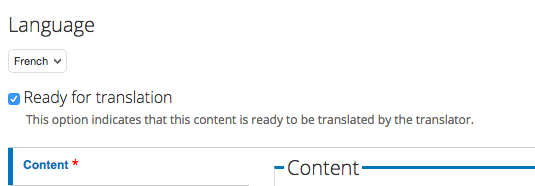
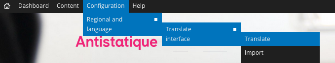

# Translation Workflow

URL to log in: http://antistatique.net/user

## Your permissions

With a "translator" role, you can edit and create a translation for any content on the website. You can't create new content.

## Dashboard

The **Dashboard** (http://antistatique.net/en/admin/dashboard) will allow you to see which content is ready to be translated. You can then click on the "translate" link to create a new translation.

If a content is set as **Ready for translation**, it will appear on your **Dashboard**. You can uncheck the checkbox once the translation is done, so that the content is no longer listed on the Dashboard.

## Interface

Some strings originate from Drupal itself and is not some content we wrote directly. You can edit those text strings from this page: http://antistatique.net/en/admin/config/regional/translate/translate

We let you access this section so that you can edit some errors you might find on the website. There is absolutely no need to translate everything here (actually, most of this text is from the admin interface).

---

And that's it! If you have any question or if some info is missing, please contact us ;) Thank you!
